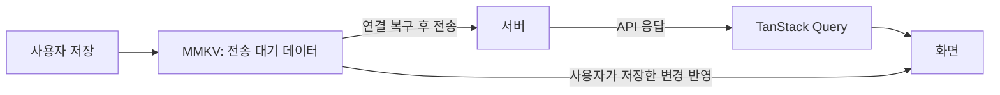

# BuddyBird 상태 관리 설계

앱 종료나 네트워크 단절로 사용자 데이터를 잃지 않고, 같은 계정의 여러 기기에서 일관된 데이터를 사용하도록 저장과 동기화 기준을 정합니다.

## 설계 전제

### 설계 배경

[부재중 앵무새 케어 PRD](/Users/user/Desktop/dev/ai-sw-maestro/projects/joynnovate-hub/projects/buddybird-v2/prd/PRD-0001-부재중-앵무새-케어.md)는 새장 앞에서 재생과 감지를 수행하는 `station`, 외부에서 결과를 확인하는 `viewer`를 구분합니다. 양쪽 기기에서 단어를 등록하고 삭제할 수 있으므로, 사용자 데이터를 서버에 모으고 기기 사이의 변경을 동기화합니다.

### 데이터 관리 요구사항

- **데이터 보존**
    - 앱 종료나 네트워크 단절 후에도 저장한 단어와 프로필 유지
    - 기존 단어, 프로필, 학습 이력과 통계 보존
- **동기화 오류 방지**
    - 응답 유실 후 재전송에 따른 중복 생성 방지
    - 다른 기기에서 먼저 저장한 수정의 덮어쓰기 방지
- **계정 구분**
    - 계정별 데이터 분리
    - 로그아웃이나 캐시 삭제 후에도 기존 데이터의 소유 계정 유지

## 저장 책임

### 서버 데이터

여러 기기에서 같은 데이터를 사용하고 리포트를 계산할 수 있도록 사용자 데이터를 서버에 보관합니다.

- **계정 데이터:** 계정, 권한, 기기 연결
- **사용자 등록 데이터:** 앵무새 프로필, 단어, 녹음 샘플
- **활동 기록:** 세션, 재생, 감지, 판정 결과, 리포트, 알림

### 클라이언트 데이터

서버에서 받은 데이터와 아직 서버 저장을 확인하지 못한 변경을 구분합니다. 두 데이터를 섞어서 저장하면 재조회 결과가 사용자의 수정을 덮어쓰거나, 캐시(서버에서 받은 데이터의 사본)를 지울 때 전송할 내용까지 잃을 수 있습니다.

| 담당                  | 관리 대상                                                                                      |
| --------------------- | ---------------------------------------------------------------------------------------------- |
| TanStack Query        | API 응답과 요청 상태. 단어 목록, 프로필, 리포트 등 서버에서 조회한 데이터                      |
| React `useState`      | 해당 화면에서만 사용하는 입력값, 필터, 확인창 표시 여부                                        |
| Zustand               | 선택한 기기와 작업 진행률 등 여러 화면에서 공유하는 앱 내부 상태                               |
| MMKV                  | 기기 설정, 전송 대기 데이터, 계정 연결과 이전 기록, 세션 복구 정보, 오프라인 조회용 Query 캐시 |
| 파일시스템            | 녹음, 사진, 영상 파일                                                                          |
| 인증 SDK, SecureStore | 로그인 세션과 토큰                                                                             |
| 네이티브 오디오 엔진  | 실제 재생 상태와 녹음 상태                                                                     |

### 데이터 흐름

‘전송 대기 데이터’는 기기에 저장했지만 서버 저장을 확인하지 못한 변경입니다. 요청을 보낸 뒤 응답을 받지 못한 경우도 포함합니다. 다시 내려받을 수 있다는 보장이 없으므로 서버 저장을 확인하기 전까지 보존합니다.

화면에는 Query 캐시에 전송 대기 변경을 반영해 표시합니다.

- **조회 기준:** 계정, 조회 대상, 필터를 Query 키에 포함
- **중복 저장 방지**
    - API 응답 전체를 Zustand에 복사하지 않음
    - Query 데이터와 전송 대기 변경을 합친 화면용 목록을 별도로 저장하지 않음

## 사용자 데이터 동기화

### 기기 저장

인터넷이 끊겨도 단어와 프로필을 사용할 수 있도록 기기에 먼저 저장합니다. 저장 성공은 기기에 저장됐다는 뜻이며, 서버 저장 완료와 구분합니다.

1. 녹음과 사진을 보존할 위치에 저장합니다.
2. 내용, 파일 참조, 변경 종류(생성, 수정, 삭제), 전송 정보를 하나의 JSON 객체로 MMKV에 기록합니다.
3. 저장값을 확인한 뒤 저장 성공을 표시합니다.

- **저장 전 앱 종료**
    - 입력값과 임시 녹음 초안 복원 제외
    - 사용자 재등록 필요
- **저장 후 앱 재실행**
    - 저장한 내용과 파일 복원
    - 서버 저장이 확인되지 않은 변경은 전송 대기 상태 유지

### 서버 전송

인터넷 연결과 인증을 확인한 뒤 전송 대기 데이터를 보냅니다. 같은 변경을 동시에 보내지 않도록 전송은 한곳에서 담당합니다.

- **완료 기준:** 항목과 필요한 파일 및 샘플의 서버 저장 확인
- **완료 처리**
    - Query 데이터 갱신
    - 확인된 변경만 전송 대기에서 제거
- **전송 실패**
    - 기기 데이터 유지 후 재시도
    - 요청 거부나 수정 충돌은 사용자에게 안내
- **응답 유실**
    - 같은 요청 ID와 내용으로 재전송
    - 서버는 중복 생성 없이 기존 처리 결과 반환
- **전송 중 재수정**
    - 새 수정 내용을 별도로 보존
    - 앞선 요청이 성공해도 새 수정은 전송 대기 상태 유지

### 조회 데이터 표시

오프라인에서 등록한 단어는 서버 목록에 없어도 기기에 저장한 내용으로 표시합니다. 서버를 다시 조회할 때도 편집 중인 입력이나 전송 대기 데이터를 덮어쓰지 않습니다.

- **오프라인 복원**
    - 저장해 둔 단어와 프로필의 Query 캐시 사용
    - 같은 계정에서는 기간 제한 없이 보관하고 조회 허용
    - 마지막 동기화 시각 표시
    - 저장 형식 버전 확인
    - 모든 사진과 녹음의 자동 다운로드 제외
- **조회 실패**
    - 복원 가능한 캐시 사용
    - 빈 목록이나 통계 0건과 구분해 표시

### 동기화 식별자

#### 항목 ID

서버에 연결되지 않은 상태에서도 항목을 식별할 수 있도록 클라이언트 ID를 발급합니다. 서버는 별도의 PK(데이터베이스에서 항목을 식별하는 기본 키)를 사용하며, 두 ID의 연결과 클라이언트 ID의 중복을 관리합니다. 두 ID 모두 UUID(고유 식별자를 만드는 표준 형식)를 사용합니다.

- **`id`:** 서버가 발급하는 PK
- **`client_generated_id`**
    - 앱이 항목을 처음 저장할 때 발급
    - 수정이나 재전송 후에도 유지
    - 서버가 항목 종류별로 `(user_id, client_generated_id)` 중복 방지

#### 변경 요청 ID

같은 요청을 다시 보내도 중복 저장되지 않도록 변경 요청에 ID를 부여합니다.

- **`change_id`**
    - 전송할 변경마다 발급하는 UUID
    - 같은 요청의 재시도에서는 ID와 요청 내용 유지
    - 서버가 이미 처리한 요청인지 확인하는 기준

### 수정 충돌 처리

다른 기기에서 저장한 변경을 덮어쓰지 않도록 데이터 버전(수정될 때마다 갱신되는 값)을 비교합니다. 예를 들어 앱은 버전 7을 기준으로 편집했는데 서버는 이미 버전 8이라면, 다른 변경이 먼저 저장된 상태입니다.

- **비교 대상**
    - `base_version`: 앱에서 편집을 시작할 때의 서버 데이터 버전. 새 항목에는 없음
    - `version_id`: 서버에 저장된 최신 데이터 버전
- **비교 결과에 따른 처리**
    - 버전 일치: 수정 요청 반영
    - 버전 불일치:
        - 서버 내용과 기기에서 수정한 내용을 함께 표시
        - 사용자가 적용할 내용을 선택
        - 선택을 마칠 때까지 기기의 수정 내용 보존

기기마다 시계가 다를 수 있고 늦게 도착한 요청이 더 최근의 수정이라는 보장도 없으므로, 기기 시각으로 최신 수정을 판단하지 않습니다.

### 동기화 검증

- **서버:** 요청한 계정의 데이터 변경 권한 확인
- **클라이언트**
    - 응답의 계정 ID, 항목 ID, 변경 ID 확인
    - 다른 계정의 응답을 화면에 적용하지 않음
    - 이전 요청의 응답으로 새 수정을 완료 처리하지 않음

## 계정 데이터 관리

### 데이터 소유 계정

비회원으로 사용하다가 중간에 회원가입하는 흐름은 제공하지 않습니다. 계정 도입 전 버전에서 저장한 데이터는 기존 데이터 이전 절차로 처리합니다.

MMKV 파일은 기기에 저장되므로, 앱이 제품 서버의 내부 사용자 ID로 저장 영역을 나눠 계정별 데이터를 구분합니다.

- **기존 데이터 연결**
    - 대상: 단어, 프로필, 학습 이력, 통계
    - 소유자: 처음 로그인에 성공한 계정
    - 연결 기록: 로그아웃과 캐시 삭제 후에도 유지
- **소유 계정 기록 유실**
    - 서버에서 기존 연결 확인
    - 확인 전까지 다른 계정에 연결하지 않음

### 로그인 계정 변경

계정 데이터가 섞이지 않도록 로그인 계정을 변경할 때는 이전 계정의 작업을 중단하고, 새 계정의 데이터로 화면을 갱신합니다.

- **이전 계정 처리**
    - 데이터 변경 구독 중단
    - 진행 중인 API 요청과 데이터 전송 중단
    - 전송 대기 데이터 보존
- **새 계정 처리**
    - 새 계정의 Query 캐시 사용
    - 새 계정의 데이터로 화면 갱신
- **실행 중인 세션**
    - 세션 종료 확인 절차 유지
    - 실행 중 세션의 소유 계정 변경 금지

### 오프라인 인증

오프라인에서는 이전에 확인한 인증 SDK 사용자와 서버 내부 계정 ID의 연결을 사용합니다. 서버에 데이터를 전송할 때는 인증을 다시 확인합니다.

### 미디어 수집 동의

영상과 음성은 사용자 동의를 받은 뒤 수집합니다(PRD NFR-02).

### 계정 삭제

계정 삭제 시 서버에 저장한 기록도 삭제합니다(PRD NFR-02). 로그아웃과 달리 데이터를 삭제하는 처리이므로, 기기에 남은 전송 대기 데이터가 삭제된 계정의 기록을 다시 생성하지 않도록 해야 합니다.

## MMKV 저장 설계

### 저장 영역

- **`buddybird.device`**
    - 기기 설정: 언어, 분석 동의, 업데이트 안내, 피드백 표시 설정
    - 이전 기록: 기존 데이터의 최초 소유 계정과 이전 근거
    - 기기 식별자: 서버에 등록하는 `client_device_id`, 키 `device/clientId`
- **`buddybird.user.<계정 ID>`**
    - 단어 전송 대기 데이터: `local/word/<client_generated_id>`
    - 프로필 전송 대기 데이터: `local/bird/<client_generated_id>`
- **계정별 Query 캐시**
    - 보관 대상: 단어 목록과 프로필
    - 저장 방식: Query가 제공하는 캐시 저장 기능(persister)

### 데이터 저장 단위

독립적으로 바뀌는 설정은 키를 나누고, 한 작업에서 함께 바뀌어야 하는 값은 같은 JSON 객체에 저장합니다. 예를 들어 단어 내용과 전송 정보를 따로 쓰다가 앱이 종료되면, 단어만 남고 전송 정보는 빠질 수 있습니다.

- **함께 저장할 데이터**
    - 단어: 내용, 전송 정보, 최대 5개 샘플의 메타데이터(샘플을 설명하는 정보)
    - 프로필: 내용과 전송 정보
    - 파일 교체: 교체 정보와 삭제 대기 정보
    - 학습 정산: 학습 이력과 중복 정산 방지 기록
- **로컬 키:** 서버 `id`를 받은 뒤에도 유지

### 스키마 버전 관리

저장 형식의 변경과 서버 데이터의 수정을 구분할 수 있도록 별도의 버전을 사용합니다.

- **`schemaVersion`:** JSON 저장 형식을 식별하는 스키마 버전
- **`version_id`:** 서버 데이터의 수정 여부를 확인하는 버전
- **형식 변경 처리**
    - 지원하는 버전만 변환
    - 읽을 수 없는 데이터나 지원하지 않는 버전은 원문 보존
    - 빈 값으로 덮어쓰지 않음

### 미디어 파일 관리

실제 파일은 파일시스템에 저장하고, MMKV에는 경로와 메타데이터를 기록합니다. 여러 MMKV 키와 파일을 한꺼번에 저장하는 트랜잭션(모든 변경을 함께 성공시키거나 취소하는 처리)은 가정하지 않습니다.

- **파일 보관 위치**
    - 기기 원본: 파일시스템
    - 업로드한 파일: 서버 파일 저장소
- **파일 교체**
    - 새 파일을 먼저 보존
    - 같은 파일을 사용하는 이력과 세션 복구 정보의 참조 갱신
- **이전 파일 삭제 조건**
    - 이력, 실행 중 세션, 전송 대기 데이터, 데이터 이전 원문에서 참조하지 않을 때 삭제
    - 참조 중인 파일은 Query 캐시가 삭제돼도 보존

## 기존 데이터 이전

### 이전 대상

기존 통계는 새 리포트와 수집 기준이 다르므로 원래 의미로 보존합니다. 정확한 재생량이나 따라 말하기 성공 횟수로 바꾸어 해석하지 않습니다.

- **이전 대상**
    - 사용자 단어와 원본 녹음
    - 앵무새 프로필과 사진
    - 학습 이력과 통계
    - 단어 ID와 학습 이력의 연결
- **이전 제외:** 기존 자동 오디오 캡처
- **유지할 기능:** 새 캡처 저장과 네이티브 실행 복구

### 데이터 이전 절차

일부 항목의 변환 실패가 정상 데이터 사용을 막지 않도록, 데이터 이전은 앱 시작과 분리해서 실행합니다.

1. **원본 보존**
    - 이미 MMKV를 사용한 기기는 최신 MMKV를 기준으로 변환
    - 오래된 AsyncStorage 값으로 수정하거나 삭제한 데이터를 되돌리지 않음
    - 변환 전 원문은 `buddybird` 인스턴스의 `buddybird.migration-source.v1`에 보존
2. **항목별 변환**
    - 변환 결과와 해당 항목의 완료 기록을 함께 저장
3. **재시도**
    - 실패한 항목만 다시 처리
    - 그동안 사용자가 수정한 데이터와 새로 쌓인 통계 유지

### 이전 실패 처리

- **공통 처리:** 원문과 파일 보존, 오류 표시
- **프로필 이전 실패:** 신규 사용자로 처리하지 않음
- **제품 데이터 전체를 읽을 수 없는 경우**
    - 오류 화면 표시
    - 재시도와 언어 선택 제공

### 이전 완료 기준

`migration.complete`는 기기 안에서의 이전 완료를 뜻합니다. 서버 저장을 확인하기 전까지 기존 원본을 보존하며, 익명 단어 수집 API의 성공을 계정 동기화 완료로 처리하지 않습니다.

## 기능별 데이터

### 기기 연결

같은 계정에 여러 station과 viewer를 연결하고 접근 권한을 구분할 수 있도록 연결 관계를 서버에 저장합니다(FR-01, FR-05).

- **식별자:** 계정 ID, 기기 ID, station ID, 앵무새 ID
- **연결 정보:** 연결 관계, 역할, 권한

### 단어 정보

단어별 샘플 등록과 삭제, 모든 샘플의 기기 간 동기화를 지원하도록 단어와 샘플을 각각 식별합니다(FR-14, FR-15, FR-17).

- **식별자:** 단어 ID, 샘플 ID, 파일 ID
- **관리 정보:** 태그, 버전, 삭제 상태
- **샘플 개수:** 단어별 1~5개

### 세션 정보

#### 세션 실행 설정

수면 시간과 원격 설정을 반영하고 세션을 복구할 수 있도록 실제 적용한 설정을 보존합니다(FR-08, FR-10, FR-11).

- **식별자:** station ID, 세션 ID
- **적용 정보:** 설정 내용, 샘플 버전, 파일 참조
- **수면 설정:** 일정과 시간대
- **원격 명령**
    - 명령 내용과 실제 적용 결과 보관
    - 서버 접수와 station 적용 구분
    - 이전 세션의 명령을 다음 세션에 적용하지 않음
- **앱 재실행:** 네이티브 엔진에서 실제 실행 상태를 확인해 복구

#### 장기 실행 기록

10일 이상 실행해도 기록을 잃거나 중복 전송하지 않도록 서버 저장이 확인된 범위를 관리합니다(NFR-01). 장기간 쌓이는 기록까지 MMKV에 저장할지는 실제 누적량과 저장 비용을 확인한 뒤 결정합니다.

- **관리 항목**
    - 기록 순서
    - 서버 저장이 확인된 범위
    - 전송 대기 범위
    - 파일 사용량

### 학습 리포트

리포트는 서버에 모인 기록으로 계산합니다. 기기는 서버 저장이 확인되지 않은 기록과 세션 실행에 필요한 데이터 및 파일을 보존합니다.

- **집계 기준:** station과 세션
- **집계 오류 방지**
    - 앵무새 개체별 결과로 추정하지 않음
    - 재전송에 따른 중복 집계 방지
    - 감지 건수와 따라 말하기 성공 횟수 구분
- **과거 기록 보존**
    - 사건 발생 시각과 서버 수신 시각을 별도로 기록
    - 당시 버전과 화면 표시에 필요한 정보 유지

#### 재생 기록

샘플별 재생을 단어별 횟수와 시간으로 합산할 수 있도록 실제 재생량을 기록합니다(FR-26).

- **식별자:** 기록 ID, 세션 ID, 샘플 ID
- **재생 정보**
    - 시작 시각
    - 완료나 중단 시각
    - 엔진이 확인한 재생량

#### 감지 기록

감지한 소리를 다시 확인하고 단어와 비교할 수 있도록 녹음 파일을 보존합니다(FR-19, FR-20).

- **저장 항목:** 감지 ID, 감지 시각, 녹음 파일

#### 판정 기록

등록된 모든 샘플과 비교한 결과를 리포트에 반영할 수 있도록 판정에 사용한 데이터와 기준을 기록합니다(FR-20, FR-26).

- **비교 대상:** 단어 버전, 샘플 버전
- **판정 정보:** 판정 결과, 판정 기준 버전

### 응급 상황 기록

응급 상황을 나중에 확인할 수 있도록 감지 전후 30초씩 기록합니다. 오디오만 저장하는 단계에서 영상과 오디오를 함께 저장하는 단계로 확장할 수 있도록 파일 종류와 클립 범위를 남깁니다(FR-22, FR-23).

- **식별자:** 사건 ID, station ID, 세션 ID, 파일 ID
- **미디어 정보:** 클립 범위, 파일 종류
- **관리 정보:** 삭제 상태, 만료 상태

### 알림 이력

과거 알림을 조회하고 해당 기록으로 이동할 수 있도록 알림 이력을 서버에 보관합니다(FR-27~FR-32).

- **알림 정보:** 알림 ID, 종류, 대상 기록
- **사용자 설정:** 종류별 알림 수신 여부

### 기기 연결 상태

station이 멈췄거나 연결이 끊겼는지 판단할 수 있도록 서버가 마지막 heartbeat(기기의 동작을 알리는 주기적 신호)를 받은 시각을 기록합니다(FR-30).

## 검토한 대안

| 대안                                    | 선택하지 않은 이유                                                                                |
| --------------------------------------- | ------------------------------------------------------------------------------------------------- |
| 서버 응답 후에만 저장 성공 처리         | 오프라인에서도 단어와 프로필을 저장해야 하므로 선택하지 않습니다.                                 |
| 기기 전체 데이터를 하나의 JSON으로 저장 | 계정별 분리와 데이터별 보관 기간을 관리하기 어렵고, 작은 수정에도 전체 데이터를 다시 써야 합니다. |
| 모든 필드를 개별 MMKV 키로 저장         | 함께 반영해야 하는 변경이 여러 쓰기로 나뉘어 일부만 저장될 수 있습니다.                           |
| 기기 수정 시각으로 충돌 해결            | 시계 차이와 지연된 전송 때문에 다른 기기의 수정을 잘못 덮어쓸 수 있습니다.                        |

## 미정 사항

구현 전에 아래 정책을 확정해야 합니다.

- **장기 실행 기록 저장**
    - 결정 대상: MMKV 또는 별도 로컬 DB 사용, 용량 부족 시 처리
    - 다음 확인: 10일 분량의 기록 수와 파일 크기 측정
- **녹음 가이드 숨김 설정**
    - 결정 대상: 기기 하나 또는 같은 계정의 모든 기기에 적용
    - 다음 확인: PRD의 미해결 질문 확정 후 MMKV 설정과 서버 설정 중 선택
- **계정 삭제 후 기기 정리**
    - 결정 대상: 오프라인 기기에 삭제 사실 전달, 전송 대기 데이터와 파일 정리 방법
    - 다음 확인: 인증 및 계정 삭제 API의 처리 기준 합의

## 참고 자료

- **공식 문서**
    - [MMKV 3.3.3](https://raw.githubusercontent.com/mrousavy/react-native-mmkv/v3.3.3/README.md)
    - [TanStack Query 캐시 영속화](https://tanstack.com/query/latest/docs/framework/react/plugins/persistQueryClient)
- **Bluesky**
    - [설정과 계정별 저장](https://github.com/bluesky-social/social-app/blob/2bfb94d4c0f07a63f4b7a89ed047c29d7d0c00c7/src/storage/index.ts)
    - [선별한 Query 캐시 저장](https://github.com/bluesky-social/social-app/blob/2bfb94d4c0f07a63f4b7a89ed047c29d7d0c00c7/src/lib/react-query.tsx)
- **Rocket.Chat**
    - [MMKV 설정 저장](https://github.com/RocketChat/Rocket.Chat.ReactNative/blob/8453d9a7c50d4d6a9195033732a1b924eec62373/app/lib/methods/userPreferences.ts)
    - [메시지용 DB](https://github.com/RocketChat/Rocket.Chat.ReactNative/blob/8453d9a7c50d4d6a9195033732a1b924eec62373/app/lib/database/index.ts)
- **Ignite**
    - [내비게이션 상태를 하나의 JSON으로 저장](https://github.com/infinitered/ignite/blob/e829d2f922c5568a59a77bfb6232aeb500be3f13/boilerplate/app/navigators/navigationUtilities.ts)
